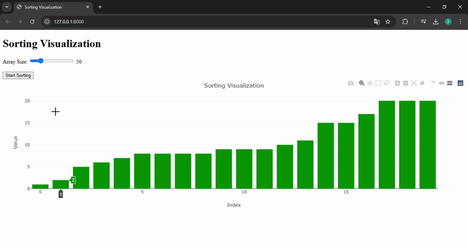

# Sorting Algorithm Visualization Web App

A web application built with Django that visually demonstrates the Quick Sort algorithm. The app allows users to choose the size of the array and observe how the algorithm sorts it step by step.

## Features

- Interactive visualization of the Quick Sort algorithm.
- Users can adjust the size of the array using a slider.
- Real-time updates of the sorting process visualized as a bar chart.
- Built using Django for the backend and Plotly.js for the frontend visualization.

## Demo

 

## Technologies Used

- **Backend**: Django
- **Frontend**: HTML, CSS, JavaScript, Plotly.js
- **Additional Libraries**: NumPy for generating random arrays
